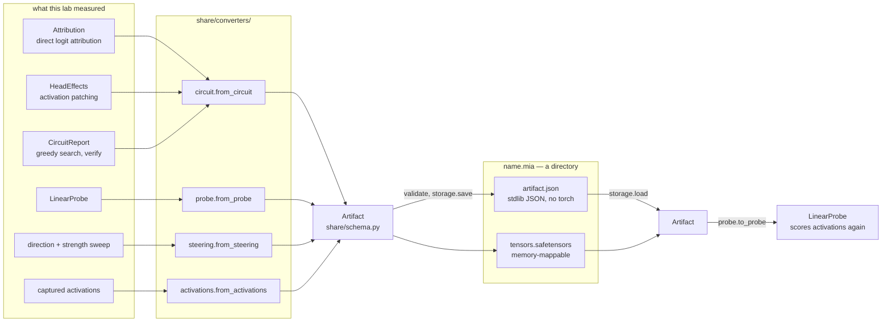
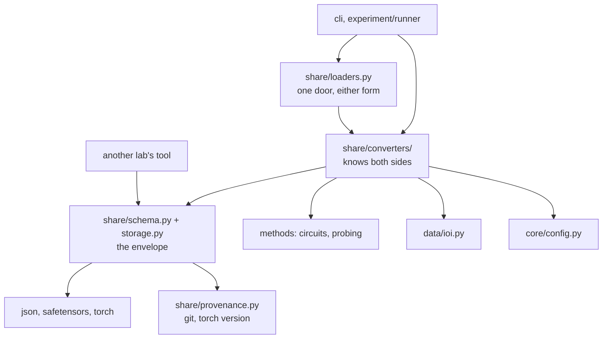

# Sharing, drawn

Diagrams for the `.mia` envelope and the converters that fill it. The prose is
[`../artifact-format.md`](../artifact-format.md) and the field-by-field specification is
[`../rfcs/0001-mia-format.md`](../rfcs/0001-mia-format.md); these pages are the same thing as
pictures, for reading before either rather than instead of them.

- [format.md](format.md) — what a card holds, and what `validate()` refuses to let out
- [landscape.md](landscape.md) — what already exists for this elsewhere, and where it stops

## The round trip

`share/schema.py` and `share/storage.py` are the envelope and know nothing about this
repository. `share/converters/` is where the two sides meet, which is what keeps
`storage.load` from importing transformers.

Four doors in and one door back is the honest shape today. Every converter is lossy on
purpose — it writes down what another lab needs to *use* the result and not the intermediate
state that only means something inside this process — but `probe` is the kind that has been
carried all the way back to a working object, and that round trip is the test of the format.
A shared artifact that does not come back as something you can call has shared nothing.

## Where the boundary sits

The import direction is the whole design. `schema.py` and `storage.py` sit under `converters/`
and never learn what an `IOIDataset` is, so a reader with neither transformers nor this
repository installed can still open a card.

`another lab's tool` reaching `schema.py` without passing through anything else is the
property being protected. Add a converter for a new experiment kind as a module under
`converters/`; adding a special case inside `schema.py` moves that line.
