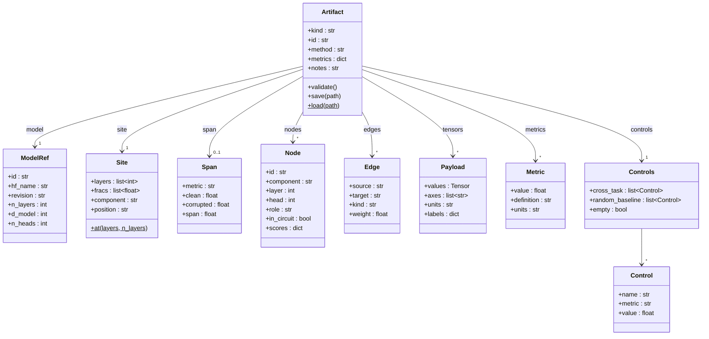
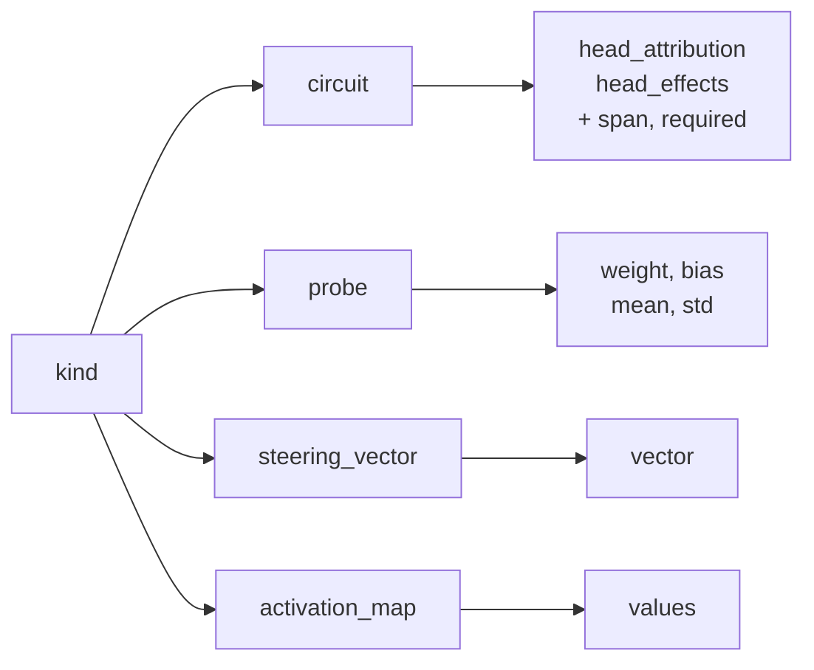
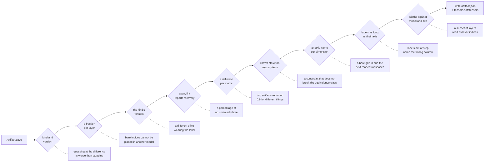
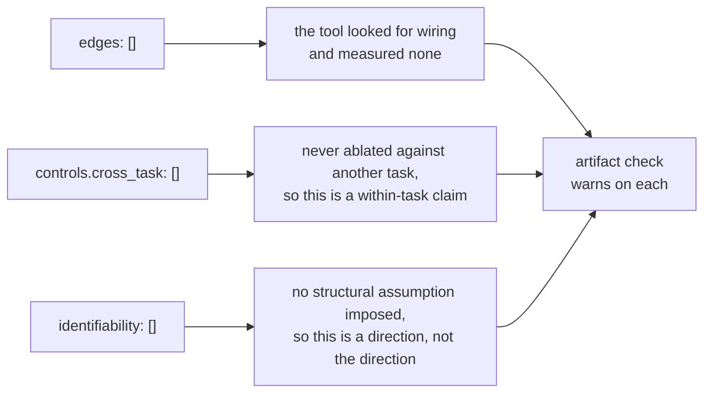
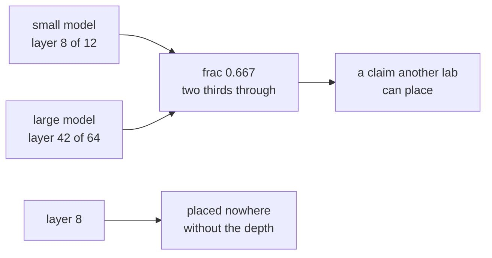

# The card, and the gates

## What an artifact holds

Everything on the card exists because leaving it out is a way a number gets misread
somewhere else. `Payload` is the one to look at twice: values, axes, units and tick labels
are one object, so there is no call that stores a tensor without saying what it means.

`Edge` is in the schema and every circuit this repository emits carries an empty list of
them. That is the honest state of the art rather than a gap: an artifact that says it found
no edges is different from one that left a reader guessing whether the tool looked.

`Metric` is the same idea as `Payload`, applied to a number rather than a grid. A value, what
it is in, and what was computed to get it, in one object — because `faithfulness` names a
logit-difference recovery here and a normalized KL reproduction elsewhere, and both land near
0.9.

`Controls` is written even when both its lists are empty, for the reason `Edge` is. A circuit
that was never ablated against another task and one that was must not be byte-identical, and
`Controls.empty` is the question a reader asks first.

`Node.scores` holds both halves of the circuit study — `attribution` and `causal` — because
they disagree and the disagreement is the finding. One summary score per component throws
away the result that the second measurement exists to produce.

## The kind decides what has to be there

An artifact missing these is not an incomplete artifact of that kind. It is a different
thing wearing the label, and `validate()` says so rather than letting a reader find out by
getting a `KeyError` in the middle of applying it.

## What refuses to leave the machine

Validation runs at `save`, not only at `load`, so a wrong artifact never ships. The solid
line is the way through; each dashed branch is the plausible-looking wrong number that gate
exists to stop.

The header is duplicated into the safetensors metadata, so a `tensors.safetensors` that got
separated from its card still says what it is.

## What ships empty on purpose

Three fields are written with nothing in them by every artifact this repository emits. None of
them is a placeholder — each is the recorded absence of a check, which is a different claim
from silence.

An artifact that ran the check and one that never considered it would otherwise be the same
bytes, and the reader would have no way to tell which they were holding.

## Why the site is a fraction as well as an index

Layer 8 of a twelve-layer model and layer 42 of a sixty-four-layer one are the same place.
Only the fraction survives a model swap, and deriving one from the other needs a depth the
reader may not have resolved — so both are written down.

`Site.at` requires `n_layers` rather than defaulting it away, which is why packing a probe
made this repository teach `LinearProbe` to carry its own `n_layers`. The format asked a
question the code could not answer, and the code changed.
