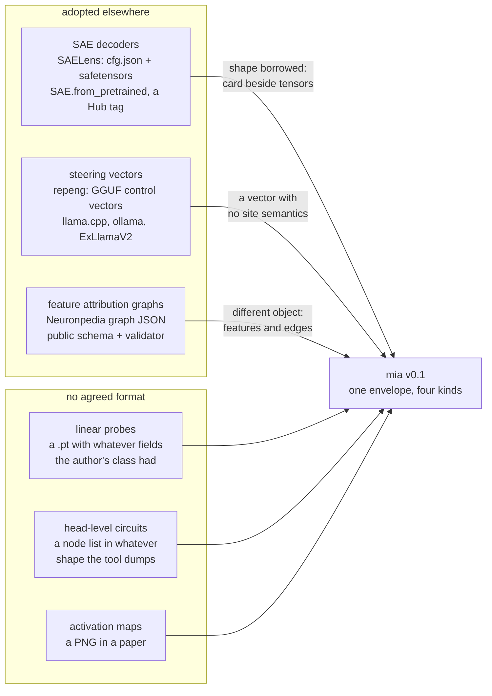

# What already exists elsewhere

Checked August 2026. There is no envelope covering probes, steering vectors, circuits and
activation maps together; there is a separate, mostly incompatible format per artifact kind,
and only two of them are really adopted.

## Per kind

| kind here | closest prior art | why it does not cover this |
|---|---|---|
| `steering_vector` | [repeng](https://github.com/vgel/repeng) GGUF control vectors, [merged into llama.cpp](https://github.com/ggml-org/llama.cpp/pull/5970) and picked up by [ollama](https://github.com/ollama/ollama/pull/8148); the [`steering-vectors`](https://pypi.org/project/steering-vectors) package | the real incumbent, and explicitly proposed as a common export format — but it is per-layer vectors with almost no metadata: no sweep, no baselines, no site beyond the index |
| `circuit` | [Neuronpedia's graph and feature-detail schemas](https://www.neuronpedia.org/graph/validator), derived from Anthropic's [circuit-tracer](https://www.neuronpedia.org/blog/circuit-tracer) formats | a *feature*-level attribution graph from transcoders, whose whole point is edges. This measures which heads matter, stores two disagreeing scores per head, and says `edges: []` |
| `probe` | nothing agreed. [pyvene](https://github.com/stanfordnlp/pyvene) serializes interventions to the Hub | pyvene ships an intervention *config* attached to a model, not a self-describing measurement readable without one |
| `activation_map` | nothing in interpretability. Outside it, [xarray](https://docs.xarray.dev) | `Payload` is essentially a `DataArray` — labeled axes on a tensor is the shape people reach for once they want to subtract two of them |
| — | [SAELens](https://github.com/decoderesearch/SAELens) `cfg.json` + safetensors + a Hub tag | not a competitor: the one success worth copying. Same shape as `.mia` — a card next to a tensor file — which suggests the shape is right |

## What is not out there

The four requirements in [format.md](format.md) — axes and units mandatory on every tensor, a
site carrying its depth fraction, a recovery forced to carry the span it is a fraction of,
and a node keeping both measurements. Every one of them is a way a shared result gets
misread, and no format above enforces any of them.

That is also the reason not to fold this into one of them yet. Emitting a Neuronpedia graph
would mean claiming edges that were never measured; emitting a GGUF control vector would
mean dropping the sweep that says at which strength the text falls apart. Both are lies the
target format cannot express as anything else.
